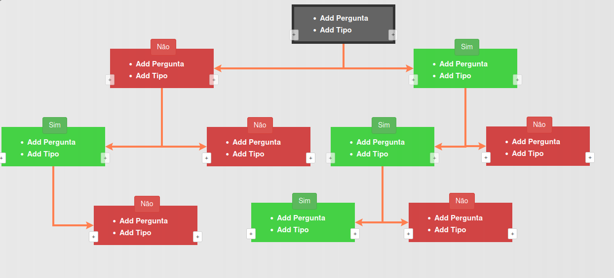

# Drawing a responsive Binary Tree with JS

This repository is a result of my work trying to draw a web page, 
which later is going to feed an REST-API, so a have a binary 
tree that is build following the need of the user.

In order to run this repo there are two dependencies:
+ [_leader-line.min.js_](https://anseki.github.io/leader-line/)
+ [_plain-draggable.min.js_](https://anseki.github.io/leader-line/)

Both of these projects are awesome, check them up for more information.
Copy both of these javascript files at this directory then open 
index.html at the web browser.

**Note**: The diagram can be easily adapted, the more difficult part 
was to generate the binary tree objects in javascript.
Later I will insert an example on how to generate the tree.

